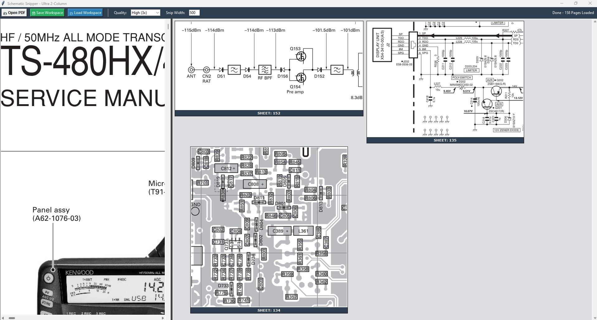

This is a great idea for a GitHub repo. Tools like this—specific, functional, and solving a real-world pain point—are exactly what people look for.

I've written this README to be professional yet accessible, highlighting the "Recall" feature as a major selling point.

---

# Schematic Snipper & Troubleshooter

**Schematic Snipper** is a Python-based desktop utility designed for hardware engineers, technicians, and hobbyists. It allows you to navigate complex, multi-page PDF schematics, "snip" critical circuit blocks (power rails, MCU pinouts, connectors), and pin them to a persistent sidebar for side-by-side reference.

No more flipping between Page 4 and Page 120 while trying to trace a signal.

## 🚀 Features

* **PDF Navigation:** Smoothly scroll through large-scale schematics with high-resolution rendering.
* **Intuitive Snipping:** Click and drag to capture any portion of the schematic.
* **Unified Workspace:** All snippets are automatically resized into uniform 300x300 "cards" for a clean, organized view.
* **Session Recall:** Save your entire troubleshooting session (including the PDF path and all captured snippets) to a folder and reload it later.
* **Source Tracking:** Each snippet is labeled with its original page number for easy back-referencing.
* **Contextual Cleanup:** Right-click any snippet to remove it from your workspace instantly.

## 🛠️ Installation

### 1. Prerequisites

Ensure you have Python 3.x installed. You will need `PyMuPDF` (for PDF handling) and `Pillow` (for image processing).

### 2. Install Dependencies

```bash
pip install pymupdf Pillow

```

### 3. Clone and Run

```bash
git clone https://github.com/YOUR_USERNAME/schematic-snipper.git
cd schematic-snipper
python main.py

```

## 📖 How to Use

1. **Open PDF:** Load your schematic using the toolbar.
2. **Navigate:** Use the Prev/Next buttons or the scrollbars to find your target components.
3. **Snip:** Left-click and drag a red box over the circuit area you want to save.
4. **Reference:** As you snip, the blocks appear on the right. You can now change pages and keep those critical references visible.
5. **Save:** Click **Save Workspace** to create a folder containing your project's "Cheat Sheet."
6. **Load:** Next time you work on the same board, click **Load Workspace** to pick up right where you left off.

## 🖥️ Preview



## 📝 License

Distributed under the MIT License. See `LICENSE` for more information.

---


